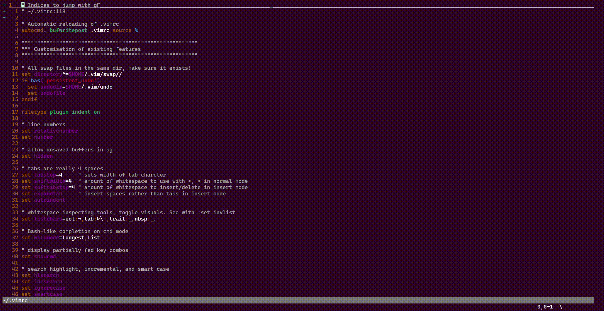

# flashcards.vim

Vim integration of flashcards - quick sticky notes with useful tips. 



Search powered by [fzf.vim](https://github.com/junegunn/fzf.vim), [rg]() and [batcat]().

## Installation

This plugin requires you to have `fzf.vim` first, as well as `rg` to efficiently search your cards. For colored `fzf`-preview you'll also need `batcat`.

Install requisites:

```
sudo apt install fzf ripgrep
sudo apt install batcat  # optional
```

Using vim-plug:

```
Plug 'junegunn/fzf', { 'do': { -> fzf#install() } }
Plug 'junegunn/fzf.vim'
Plug 'pabsan-0/vim-flashcards'
```

Set a custom path in your `.vimrc` where your flashcards are to be stored and loaded from:

```
set g:flashcards_directory = ~/cards  " custom path to store your notes
```

## Usage 

If unused, the plugin will set `<leader>c` as default mapping to call the flashcards search. You can also call it via the slower `:FlashcardsRg` and `:FlashcardsFzf`. 

At the search window:
- `tab`: alternate ripgrep and fzf (content / card name) search.
- `C-a`: **a**dd a new card.
- `C-t`: open card in a new **t**ab.
- `C-l`: open card in a new tab for **l**ater.
- `C-s`: open card in a new window **s**plit. Prompts for v/s afterwards.


## Features

### Managing your personal flashcards 

You'll need a flashcard collection to draw from, maybe under version control, as well as a template file for newly-created cards. Control these by setting these variables:

- `g:flashcards_directory`: existing dir to look for and create new cards into.
- `g:flashcards_template`: all new flashcards will start from this template. A default template is packaged with this plugin. 

Find my collection at [pabsan-0/flashcards](https://github.com/pabsan-0/flashcards), along a CLI utility providing minimal functionality at the terminal.

### Alternating search modes better

If you've configured `fzf` to store a search history, you can keep your query when alternating modes with `tab`. In order to do that, add the following lines to `.vimrc`.

```
let g:fzf_history_dir = '~/.local/share/fzf-history'

" Optional: Remap bindings to keep <c-p> and <c-n> as usual for up-down navigation
let $FZF_DEFAULT_OPTS = '--bind ctrl-n:down,ctrl-p:up,alt-n:next-history,alt-p:prev-history'
```

### Colored preview in fzf search

Typically, `batcat` is the prime choice for rendering `fzf` code previews. To enable color preview for `flashcards`:

```
$ sudo apt install bat

$ mkdir -p $(batcat --config-dir)/syntaxes
$ cp assets/flashcards.sublime-syntax $(batcat --config-dir)/syntaxes
$ batcat cache --build
```

Then configure `fzf` to use `batcat` as a previewer. It will automatically recognise the filetype and apply colors.


## Flashcards ftplugin

Besides the basic fuzzy search and file handling, this plugin implements a filetype `flashcards` for better display when editing them.

- Flashcard files are recognized by the `*.fc` extension.
- They should not exceed a fixed lenght to avoid being hard to read.
- Similarly, they auto-format on save to keep things tidy and enforce consistency.

Several fields are defined for this filetype, but you can use them as you like:

```
name    One liner description

==================================================
FLASHCARD 01                           01-Jan-2024

Optional title
tip  : explanation
tip  : explanation
tip  : explanation

```

- Boilerplate: 
    - Name, description: self-explanatory
    - Separator: a row of `===` that help recognise the file 
    - A consistency-unenforced card number following an Uppercase title. Use as you like
    - User-specified date. Use as you like
- Content
    - Section title. Discouraged for single-block cards, keep as simple as possible.
    - Tips: left of the character sequence `  : `. Highlighted and easily-spottable
    - Explanation: right of the `  : ` sequence. Extra details

